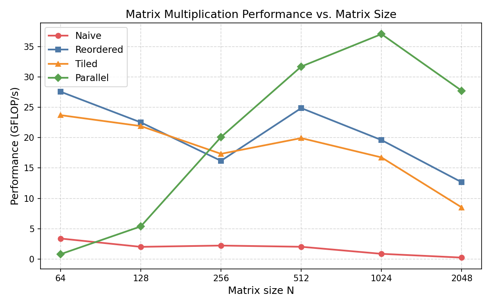

# Lab Report – Matrix Multiplication on CPU
**Course:** AI Accelerators (AIA)
**Lab:** Praktikum 1
**Team members:** Danny Schönhals
**Date:** 30.04.2026

---

## Task 1 – System Characterisation

> Fill in the details of your machine. Use tools such as `lscpu`, `lstopo`, `/proc/cpuinfo`.

> I used following for CPU-Modell, cores, threads and base: Get-CimInstance Win32_Processor | Select-Object Name, NumberOfCores, NumberOfLogicalProcessors, MaxClockSpeed

| Property  | Value                                |
|-----------|--------------------------------------|
| CPU model | 11th Gen Intel(R) Core(TM) i5-1135G7 |
| Number of cores / threads | 4/8 |
| Base / Boost clock speed (GHz) | 2.419GHz |
| SIMD ISA (SSE4.2 / AVX2 / AVX-512 …) | SSE4.2, AVX, AVX2, AVX-512 (F, DQ, BW, VL) |
| SIMD width (bits / floats per vector) | 512 bits / 16 floats (FP32) or 8 doubles (FP64) |
| MAC units per core | 2 FMA units per core (FMA = Fused Multiply-Add, counts as 2 operations per instruction) |
| L1 cache size (per core) | L1 data cache: 48 KB per core, L1 instruction cache: 32 KB per core -> 80KB per core|
| L2 cache size (per core) | 5120/4 = 1280 KB per core |
| L3 cache size (shared) | 8192 KB |
| Peak theoretical throughput (GFLOP/s) | 4 × 2.419 × 16 × 2 = 308.8 GFLOP/s (for float64 -> 4 × 2.419 × 8 × 2 = 154.4 GFLOP/s) |

**How did you calculate peak throughput?**

_(formula: cores × clock × SIMD_width × MACs_per_cycle)_
-> cores = 4, clock = 2.419, SIMD_widht = 16 (FP32)/ 8 (FP64), MACS_per_cycle = 2 operations per instruction

---

## Task 2 – Loop Reordering

> Measure each loop ordering for matrix sizes 64, 128, 256, 512, 1024, 2048, 4096.

| Loop order | N=64 (GFLOP/s) | N=128 (GFLOP/s) | N=256 (GFLOP/s) | N=512 (GFLOP/s) | N=1024 (GFLOP/s) | N=2048 (GFLOP/s) | N=4096 (GFLOP/s) |
|---------------|------|------|------|------|------|------|---|
| i-j-k (naive) | 2.90 | 2.36 | 1.99 | 1.86 | 0.74 | 0.30 | - |
| i-k-j | 19.00 | 16.62 | 14.76 | 16.41 | 13.74 | 9.97 | - |
| i-k-j (a_ik) | 18.56 | 16.70 | 16.07 | 16.18 | 13.58 | 11.23 | - |
| j-k-i | 4.15 | 2.10 | 1.69 | 1.38 | 0.75 | 0.23 | - |
| k-i-j | 12.93 | 9.23 | 10.36 | 11.34 | 8.63 | 5.50 | - |
| j-i-k | 2.78 | 2.41 | 2.01 | 1.82 | 0.84 | 0.43 | - |
| k-j-i | 2.97 | 1.14 | 0.94 | 0.70 | 0.41 | 0.12 | - |

**Best ordering found:** i-k-j

**Why does this ordering perform best?**
*Overall locality:* i-k-j accesses all matrices (A, B, C) in row-major order, keeping data close in memory. Naive has bad B access, which dominates the slowdown.
*Performance impact:* For large matrices, naive's column-major B access causes ~10-20x more cache misses, dropping GFLOP/s from ~19 to ~2-3. i-k-j keeps data in cache, sustaining high performance.

_(Explain in terms of spatial locality and cache reuse of A, B, and C)_
 *Spatial locality:* All matrices (A, B, C) are accessed row-major (sequentially in memory), keeping cache line hits high.
 *Cache reuse:* In i-k-j, A and B values are reused more (A for each j, B for each i). In naive, everything is used once and discarded quickly. This is also the case without a_ik, because i and k don't change in the inner loop.
---

## Task 3 – Vectorization

> List the compiler flags you tested and their effect.

| Flags added | N=1024 (GFLOP/s) | Speedup vs. naive |
|-----------------------------------------------|------------|-----------|
| -O3 only (baseline)                           |13.74 / 0.74|1.0×       |
| -O3 -march=native                             |24.65 / 0.90|1.79×/1.22×|
| -O3 -march=native -ffast-math                 |24.52 / 0.89|1.78×/1.20×|
| -O3 -march=native -ffast-math -funroll-loops  |23.54 / 0.88|1.71×/1.19×|
| -O3 -march=native -ffast-math -fopenmp-simd   |24.64 / 0.90|1.79×/1.22×|

**Did you add any `#pragma` hints to the source?** If yes, which ones?
I tried #pragma omp simd before the inner loop in the best performing loop i-k-j. Using the baseline compiling without any Flag this loop reaches 13.99 GFLOP/s compared to 13.74 without any pragma. A small improvement. Using it in the middle loop results for a size of 1024 are 18.84GFLOP/s. Using it before the outer loop results in 18.01 GFLOP/s. 
Main computation effort in the i-k-j loop is  concentrated in the middle (k) and inner (j) loops, which is why placing #pragma omp simd before the middle loop gives the strongest improvement? Because using it in fornt of outer loop doesn't add any big improvements.

**What speedup did you achieve? Why?**
 I achieved a maximum speedup of 1.79× compared to the baseline (-O3 only) for the i-k-j loop order at N=1024. This is because the flags like -march=native enabled SIMD instructions, allowing the CPU to process multiple floats simultaneously, and -ffast-math sped up floating-point operations. The speedup was modest because the baseline -O3 already included basic optimizations, and the code was already well-optimized from loop reordering.

 *Extra:* The speedup rate for the naive loop is kind of low compared to i-k-j. The expected reason for that is, that the bottleneck of the two loops differ. While the i-k-j loop has an optimised memory access, its bottleneck is the slow computation. By speeding it up (e.g. with -ffast-math) the improvements get clear. For the naive loop the computation isn't the main problem. Because memory access makes this loop so slow, using faster compiler flags doesn't help that much.
---

## Task 4 – Loop Tiling

> Experiment with tile sizes to find the sweet spot for your cache hierarchy.

| Tile size | N=1024 (GFLOP/s) | N=2048 (GFLOP/s) |
|-----|-------|------|
| 16  | 5.15  | 4.32 |
| 32  | 16.21 | 8.09 |
| 64  | 15.43 | 8.30 |
| 128 | 12.35 | 8.15 |
| 256 | 10.55 | 8.00 |

**Best tile size:** 32

**Why does this tile size work best for your machine?**
Each tile is JB × JB floats: JB² × 4 bytes × 3 tiles

JB=32 (12 KB total) fits comfortably in L1 at ~25% capacity, leaving room for prefetch buffers, loop variables. Maximizing temporal reuse of all three tiles without thrashing.

JB=16 (3 KB total): tiles fit easily in L1 but the inner j-loop has only 16 iterations, causing excessive loop overhead relative to useful work.

JB=64 (48 KB total): exactly fills L1, so any additional overhead (pointers, prefetching, stack) causes evictions. For N=2048 this is marginally best (8.30 vs 8.09).

JB=128/256: spill into L2 (higher latency), reducing reuse benefit.
---

## Task 5 – Multithreading

> Measure scaling as you increase the number of OpenMP threads.
The reordered (i-k-j) was used for all number of threads to speed things up

| Threads | N=2048 (GFLOP/s) | Speedup |
|---|------|-------|
| 1 | 6.09 | 1.00× |
| 2 | 11.2 | 1.84× |
| 4 | 22.0 | 3.61× |
| 8 | 53.51 | 8.78× |
| _(max physical cores)_: 4

**Does throughput scale linearly with threads?** Why / why not?
Throughput scales almost linearly up to 8 threads (8.78× speedup for 8×), with small deviations because threads share the same memory bus. Beyond that, adding more threads gives no benefit because the CPU only has a hyperthreading of 8. Starting with 16 threads the performance gets even worse.
---

## Task 6 – Performance Analysis

**Is your implementation compute-bound or memory-bound?** Justify with arithmetic intensity (FLOPs / bytes).

Total FLOPs for N=2048:  2 × N × N² = 2 × N³ = 2 × 2048³ = 17.18 GLOPs
For mm avg time(torch): 89.279 ms: 17.18 GFLOPs / 0.089279 s ≈ 192.4 GFLOP/s

**Comparison vs. PyTorch (N=2048):**

|  Implementation   |GFLOP/s| % of PyTorch |
|-------------------|-------|--------------|
| Naive C           | 0.30  | 0.016%       |
| Best optimised C  | 29.15 | 15.1%        | <- 4 Threads and best vectorization
| PyTorch (CPU)     | 192.4 | 100%         |

**What is the gap and why does it exist?**

---

## Task 7 – Key Takeaways
- Memory access patterns matter enormously: simply reordering loops (i-k-j) gave up to ~40× speedup over naive by improving cache locality
- Compiler flags like -march=native unlock hardware SIMD (AVX), but only help if the bottleneck is computation. Memory-bound code barely benefits
- Tiling improves cache reuse, but only when the tile fits in L1; too small causes overhead, too large causes thrashing
- Multithreading scales nearly linearly up to the number of hyperthreads; Using more threads than hyperthreads given worsens the performance.
- Even with all manual optimizations combined, our best C code reaches only ~27.8% of PyTorch, which uses professionally tuned Basic Linear Algebra Subprograms libraries that fully exploit the hardware's vector units

---

## Figures

> Place your performance plots (GFLOP/s vs. matrix size) in the `figures/` folder and reference them here.

